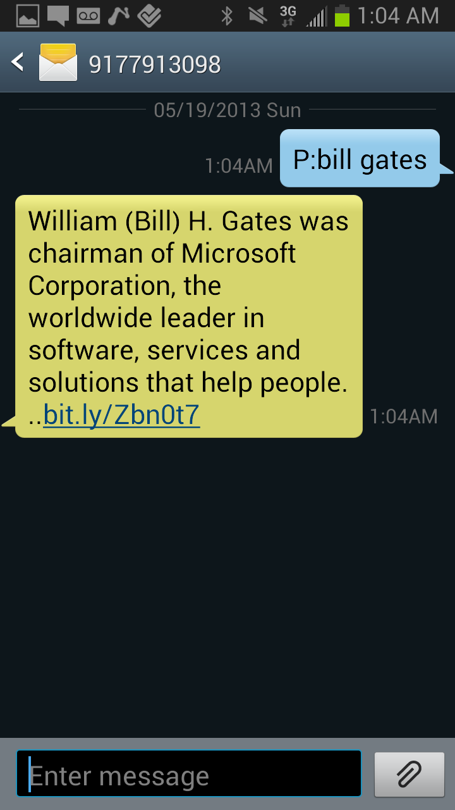
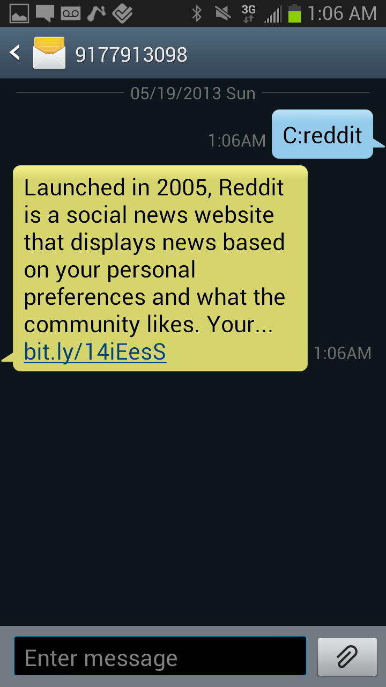

whit
====

Whit is an open source SMS service, which allows you to query CrunchBase, Wikipedia, and several other data APIs.

Simply text 917-791-3098.

Special commands include:
P:'personName', C:'companyName', S:'stockTicker', W:'wikiSearch'

<h1>P:'personName'</h1>

  

<h1>C:'company'</h1>

  

<h1>S:'stockTicker'</h1>

  

<h1>W:'wikiSearch'</h1>

  

